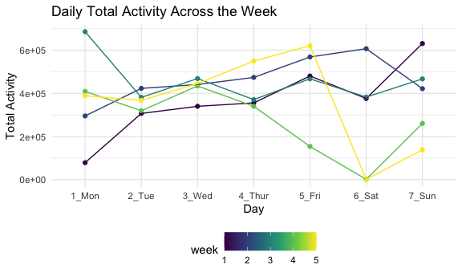
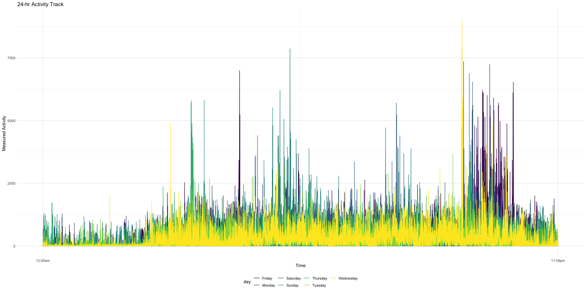

p8105_hw3_tw2838
================
Tianyou Wang
2022-10-15

## Setting Opotions

``` r
library(tidyverse)
library(p8105.datasets)
library(ggridges)
library(patchwork)

knitr::opts_chunk$set(
  fig.width = 6,
  fig.asp = .6,
  out.width = "90%"
)

theme_set(theme_minimal() + theme(legend.position = "bottom"))

options(
  ggplot2.continuous.colour = "viridis",
  ggplot2.continuous.fill = "viridis"
)

scale_colour_discrete = scale_colour_viridis_d
scale_fill_discrete = scale_fill_viridis_d
```

# Problem \#1 Instacart

``` r
data("instacart")
```

Instacart is an online grocery service that allows you to shop online
from local stores. The original dataset contains 1,384,617 observations
(rows) of 131,209 unique users, where each row in this dataset is a
product from an order. Additionally, each row is characterized by 15
variables, including user_id, ordering time, aisle and department
information etc. In total, we followed 131209 orders which are placed
across 0AM to 23PM throughout the week. Number of days since the last
order is tracked through the “days_since_prior_order” variables which is
capped at 30. Finally, this dataset involves 39123 different kinds of
products from 21 departments.

### *How many aisles, and which aisles are the most items ordered from?*

``` r
n_aisle = 
  instacart %>% 
  group_by(aisle) %>% 
  summarise(n_order = n())

nrow(n_aisle)
```

    ## [1] 134

``` r
aisle_most = 
  n_aisle %>% 
  filter(min_rank(desc(n_order)) == 1)
```

In this dataset, we have 134 different aisles, and the aisle “fresh
vegetables” have the most ordered items. There are 150609 orders.

### *Make a plot that shows the number of items ordered in each aisle*

Note: We are limiting this to aisles with more than 10000 items ordered/

``` r
n_aisle %>%
  filter(n_order > 10000) %>% 
  ggplot(aes(x=n_order/1000, y=aisle, fill=aisle)) +
  geom_bar(stat = "identity", alpha = 0.75) +
  labs(title = "Number of Items Ordered in Each Aisle",
       x = "Number of Item Ordered (in thousands)",
       y = "Aisles") +
  scale_x_continuous(
    breaks = c(0, 15, 50, 75, 100, 125, 150)) +
  theme(legend.position = "None")
```


### *Make a table showing the three most popular items in some aisles*

I am making table to show the three most popular items in “baking
ingredients”, “dog food care”, and “packaged vegetables fruits” aisles.
Including the number of times each item is ordered.

``` r
aisle_df =
  instacart %>% 
  filter(aisle == c("baking ingredients", 
                    "dog food care", 
                    "packaged vegetables fruits")) %>% 
  group_by(aisle, product_name) %>% 
  summarise(n_order = n()) %>% 
  filter(min_rank(desc(n_order)) < 4)
```

``` r
knitr::kable(aisle_df)
```

| aisle                      | product_name                                    | n_order |
|:---------------------------|:------------------------------------------------|--------:|
| baking ingredients         | Light Brown Sugar                               |     157 |
| baking ingredients         | Organic Vanilla Extract                         |     122 |
| baking ingredients         | Pure Baking Soda                                |     140 |
| dog food care              | Organix Chicken & Brown Rice Recipe             |      13 |
| dog food care              | Organix Grain Free Chicken & Vegetable Dog Food |      14 |
| dog food care              | Original Dry Dog                                |       9 |
| packaged vegetables fruits | Organic Baby Spinach                            |    3324 |
| packaged vegetables fruits | Organic Blueberries                             |    1692 |
| packaged vegetables fruits | Organic Raspberries                             |    1920 |

### *Mean ordered time for some product across the week*

Making a table to show the mean hour of the day at which Pink Lady
Apples and Coffee Ice Cream are ordered on each day of the week.
Formatting this table as a 2 x 7 table.

``` r
mean_df =
  instacart %>% 
  filter(product_name == c("Pink Lady Apples", "Coffee Ice Cream")) %>% 
  group_by(product_name, order_dow) %>% 
  summarize(mean_hr = round(mean(order_hour_of_day, na.rm = TRUE),1)) %>%
              pivot_wider(
                names_from = order_dow, 
                values_from = mean_hr)

knitr::kable(mean_df)              
```

| product_name     |    0 |    1 |    2 |    3 |    4 |    5 |    6 |
|:-----------------|-----:|-----:|-----:|-----:|-----:|-----:|-----:|
| Coffee Ice Cream | 13.2 | 15.0 | 15.3 | 15.4 | 15.2 | 10.3 | 12.4 |
| Pink Lady Apples | 12.2 | 11.7 | 12.0 | 13.9 | 11.9 | 13.9 | 11.6 |

# Problem \#2 Accelerometer, Activity Counts

### *Load, tidy, and understand the data*

``` r
accel_df = 
  read_csv(
    "data/accel_data.csv") %>% 
  janitor::clean_names() %>% 
  mutate(day_code = recode(day, "Monday" = "weekday", 
                           "Tuesday" = "weekday", 
                           "Wednesday" = "weekday",
                           "Thursday" = "weekday", 
                           "Friday" = "weekday", 
                           "Saturday" = "weekend", 
                           "Sunday" = "weekend")) %>%
  pivot_longer(activity_1:activity_1440, 
               names_to = "measure", 
               names_prefix = "activity_", 
               values_to = "value")
```

I change the format of the data set through `pivot_longer`. Two new
variables are created. “measure” stores the accelerometer measurement
times, and “value” saves the measured activity count values. We also
have 4 more variable, including “week”, “day_id”, “day”, and “day_code.”
There are total 50400 observations. We have 1440 distinct measurements
everyday for 5 weeks.

### *total activity over the day*

``` r
total_df =
  accel_df %>% 
  mutate(code = recode(day, "Monday" = "1_Mon", 
                           "Tuesday" = "2_Tue", 
                           "Wednesday" = "3_Wed",
                           "Thursday" = "4_Thur", 
                           "Friday" = "5_Fri", 
                           "Saturday" = "6_Sat", 
                           "Sunday" = "7_Sun")) %>%
  group_by(week, code) %>% 
  summarise(total_activity = round(sum(value, na.rm = TRUE), 0))

total_df_wider =
  total_df %>% 
  pivot_wider(names_from = code, 
              values_from = total_activity)
```

``` r
knitr::kable(total_df_wider)
```

| week |  1_Mon |  2_Tue |  3_Wed | 4_Thur |  5_Fri |  6_Sat |  7_Sun |
|-----:|-------:|-------:|-------:|-------:|-------:|-------:|-------:|
|    1 |  78828 | 307094 | 340115 | 355924 | 480543 | 376254 | 631105 |
|    2 | 295431 | 423245 | 440962 | 474048 | 568839 | 607175 | 422018 |
|    3 | 685910 | 381507 | 468869 | 371230 | 467420 | 382928 | 467052 |
|    4 | 409450 | 319568 | 434460 | 340291 | 154049 |   1440 | 260617 |
|    5 | 389080 | 367824 | 445366 | 549658 | 620860 |   1440 | 138421 |

``` r
ggplot(total_df, aes(x = code, y = total_activity, group = week, color = week)) +
  geom_point() +
  geom_line() +
  labs(title = "Daily Total Activity Across the Week",
       x = "Day",
       y = "Total Activity") +
  theme(legend.position = "bottom")
```



According to the scatter plot, there is no clear total daily activity
trend. The change among daily total activity is relatively stable from
Tuesday to Thursday in these 5 weeks.

### *plot that shows the 24-hr activity time*

``` r
ggplot(accel_df, aes(x = measure, y = value, group = day_id, color = week)) +
  geom_density_ridges() +
  labs(title = "24-hr Activity Track",
       x = "Time",
       y = "Measured Activity") +
  theme(legend.position = "bottom")
```

``` r
accel_df %>% 
  mutate(measure = as.integer(measure)) %>% 
ggplot(aes(x = measure, y = value, group = day, color = day)) +
  geom_line() +
  labs(title = "24-hr Activity Track",
       x = "Time",
       y = "Measured Activity") +
    scale_x_continuous(breaks = c(0, 1440), 
                     labels = c("12:00am", "11:59pm")) +
  theme(legend.position = "bottom")
```



# Problem \#3 NY NOAA Data

``` r
data("ny_noaa") 
```

This data set was accessed from the NOAA National Climatic Data Center.
We have total 2595176 observations from 747 distinct weather stations
across 10957 days. There are 7 characteristic variables, including the
weather station ID, date, precipitation, snowfall, snow depth, maximum
temperature, and minimum temperature.

### *Data Cleaning*

In this section, I am creating separate variables for year, month, and
day. Checking the units for temperature, precipitation, and snowfall.

``` r
ny_noaa_tidy = 
ny_noaa %>% 
  mutate(prcp = as.numeric(prcp),
         tmax = as.numeric(tmax), 
         tmin = as.numeric(tmin)) %>% 
  separate(date, into = c("year", "month", "day"), sep = '-') %>% 
  mutate(prcp = prcp/10, 
         tmax = tmax/10, 
         tmin = tmin/10) %>% 
  mutate(month = recode(month, "01" = "Jan", 
                        "02" = "Feb", 
                        "03" = "Mar",
                        "04" = "Apr", 
                        "05" = "May", 
                        "06" = "June", 
                        "07" = "July", 
                        "08" = "Aug",
                        "09" = "Sep",  
                        "10" = "Oct", 
                        "11" = "Nov", 
                        "12" = "Dec"))
```

``` r
getmode <- function(v) {
 uniqv <- unique(v)
 uniqv[which.max(tabulate(match(v, uniqv)))]
}

result <- getmode(ny_noaa$snow)
print(result) 
```

    ## [1] 0

For snowfall, the most commonly observed values is *0* mm. It is because
snowfall is defined as the depth of new snow in the previous 24 hours of
observation. If there is no snow, the snowfall measurement will be 0.

### *two-panel plot showing the average max temperature in January and in July across years*

``` r
ny_noaa_tidy %>% 
  mutate(month = recode(month, "01" = "Jan", 
                        "02" = "Feb", 
                        "03" = "Mar",
                        "04" = "Apr", 
                        "05" = "May", 
                        "06" = "June", 
                        "07" = "July", 
                        "08" = "Aug",
                        "09" = "Sep",  
                        "10" = "Oct", 
                        "11" = "Nov", 
                        "12" = "Dec")) %>% 
  filter(month == c("Jan", "July")) %>% 
  group_by(year, month) %>% 
  summarize(mean_tmax = mean(tmax, na.rm = TRUE)) %>% 
  ggplot(aes(x = mean_tmax, y = year)) +
  geom_point() +
  facet_grid(. ~ month) +
  labs(title = "Average Tmax in Jan Across Years",
       x = "Average Maxium Temperature (C)",
       y = "Years") + 
  theme(legend.position = "bottom")
```

    ## `summarise()` has grouped output by 'year'. You can override using the
    ## `.groups` argument.


From the scatter plot we can observe that the average maximum January
temperatures from 1981 to 2010 fluctuate more than the average maximum
July temperatures. There is no clear outliers.

### *two-panel plot showing tmax vs tmin*

``` r
tmin_p =
ny_noaa_tidy %>% 
  filter(tmin > -40) %>% 
  ggplot(aes(x = tmin)) +
  geom_density() +
  labs(title = "Minimum Temperature for the Full Dataset",
       x = "Minimum Temperature (C)") +
  scale_x_continuous(
    breaks = c(-40, -20, 0, 20, 40)) +
  theme(legend.position = "bottom")


tmax_p =
ny_noaa_tidy %>% 
  ggplot(aes(x = tmax)) +
  geom_density() +
  labs(title = "Maximum Temperature for the Full Dataset",
       x = "Maximum Temperature (C)") +
  scale_x_continuous(
    breaks = c(-60, -40, -20, 0, 20, 40)) +
  theme(legend.position = "bottom")

(tmin_p)/(tmax_p)
```


### *plot showing the distribution of snowfall values*

``` r
ny_noaa_tidy %>% 
  filter(snow < 100, snow > 0) %>% 
  group_by(year) %>% 
  ggplot(aes(x = snow, y = year, fill = year)) +
  geom_density_ridges(alpha = 0.5) +
  labs(title = "Distribution of Snowfall by year",
       x = "Snowfall (mm)",
       y = "Years") +
  scale_x_continuous(
    breaks = c(0, 20, 40, 60, 80, 100)) +
  theme(legend.position = "bottom")
```

    ## Picking joint bandwidth of 3.76


